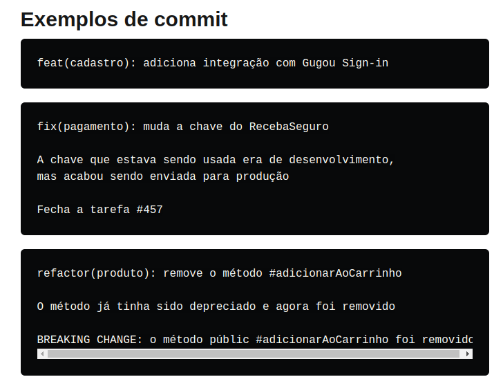

## Commitizen

Commitizen tem como objetivo definir uma maneira padrão de submeter commit e comunicá-las (usando o cli fornecido pelo commitizen).



1. Instale e configure o commitizen

```bash
npm install --global commitizen
```

### Dentro do seu projeto

```bash
commitizen init cz-conventional-changelog --save-dev --save-exact
```

### Para fazer commit

```bash
git add .
git cz
```
